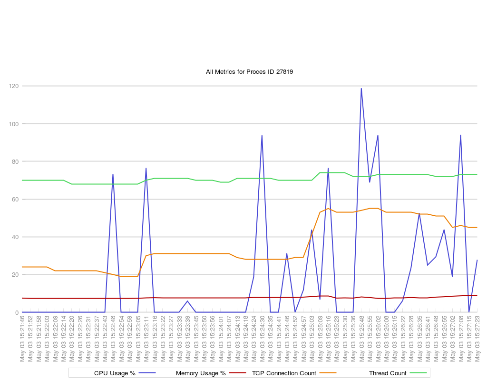

# process-metrics-collector
A Bash Script to monitor, collect, and visualize metrics of a given Linux process

## Values Collected
1. CPU Usage - Collected by the `top` command
2. Memory Usage - Collected by the `top` command
3. TCP Connection Count - Collected by the `lsof` command
4. Thread Count - Collected by the `ps` command

The data is collected at an interval of 5 seconds (this could vary slightly, but always there will be a minimum of 5 second interval).

The collected data are stored as a CSV file.

## Visualization
The resulting CSV file is translated to a graph image of `.png` type using `gnuplot`. This has to be installed (e.g. `apt install gnuplot` in Ubuntu Xenial onwards) before running this script. There are separate graphs for all the above metrics, and a separate one containing all of them together for correlation.

## License
Licensed with GNU GPL V3.
